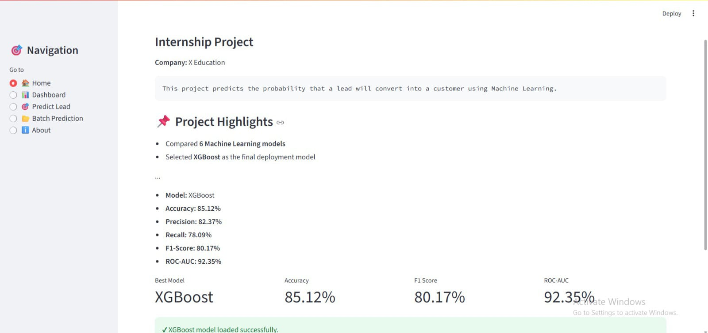
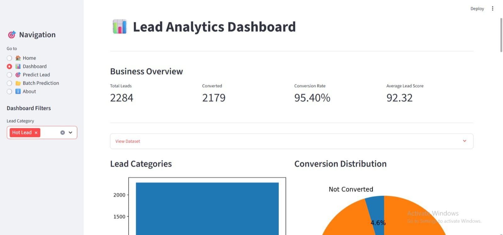
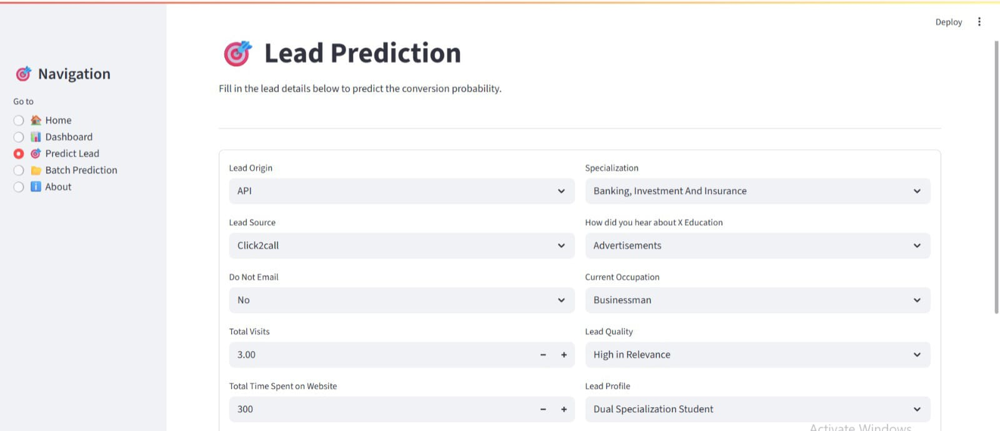
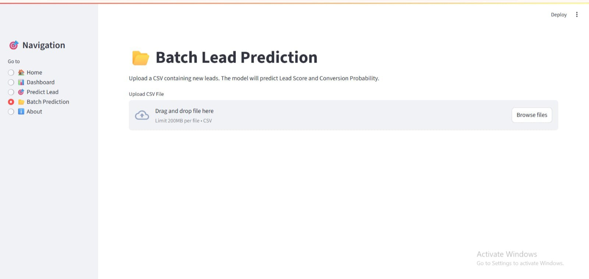
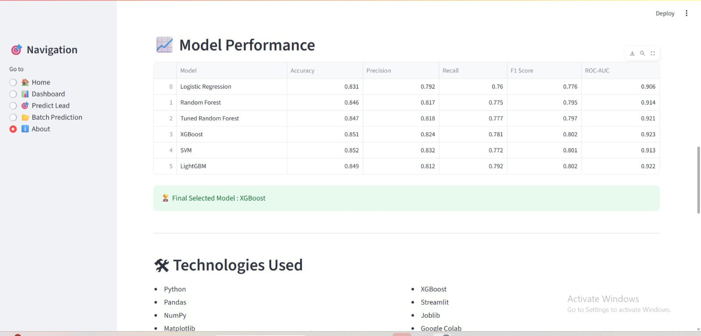

# 🎯 AI-Powered Lead Scoring System

An end-to-end Machine Learning project developed during the **Celebal Technologies Internship Program** to help **X Education** identify high-potential leads and improve conversion rates through intelligent lead prioritization.

---

## 📌 Project Overview

X Education receives thousands of leads every month through multiple marketing channels. However, only around **30%** of these leads convert into customers.

This project builds an AI-powered Lead Scoring System that predicts the probability of lead conversion and assigns every lead a **Lead Score (0–100)**, enabling the sales team to prioritize high-value prospects.

---

## 🎯 Business Objective

- Identify leads most likely to convert
- Reduce time spent on low-quality leads
- Increase sales productivity
- Support data-driven decision making
- Help achieve the target conversion rate of approximately **80%**

---

## 📊 Dataset

**Dataset:** X Education Lead Scoring Dataset

- Records: **9,240**
- Features Used: **16**
- Target Variable:
  - **Converted = 1**
  - **Not Converted = 0**

---

## 🧹 Data Preprocessing

The following preprocessing steps were performed:

- Missing Value Handling
- Duplicate Removal
- Exploratory Data Analysis (EDA)
- Feature Selection
- One-Hot Encoding
- Standard Scaling
- Train-Test Split
- Machine Learning Pipeline using Scikit-Learn

---

## 🤖 Machine Learning Models

The following models were implemented and compared:

- Logistic Regression
- Random Forest
- Tuned Random Forest
- Support Vector Machine (SVM)
- XGBoost
- LightGBM

After evaluating all models, **LightGBM** was selected as the final deployment model due to its strong overall predictive performance.

---

## 📈 Model Performance

| Model | Accuracy | Precision | Recall | F1 Score | ROC-AUC |
|--------|---------:|----------:|--------:|---------:|---------:|
| Logistic Regression | 83.06% | 79.21% | 75.98% | 77.56% | 90.56% |
| Random Forest | 84.63% | 81.66% | 77.53% | 79.54% | 91.44% |
| Tuned Random Forest | 84.58% | 81.44% | 77.67% | 79.51% | 92.30% |
| SVM | 85.23% | 83.21% | 77.25% | 80.12% | 91.32% |
| XGBoost | 85.12% | 82.09% | 78.51% | 80.26% | 91.82% |
| **LightGBM** | **85.39%** | **83.38%** | **77.53%** | **80.35%** | **92.25%** |

---

## 🚀 Streamlit Dashboard

The project includes an interactive Streamlit dashboard with the following features:

- 📊 Business Dashboard
- 🎯 Single Lead Prediction
- 📂 Batch Prediction
- 📈 Feature Importance Visualization
- 📊 Business Insights

---

## 📂 Project Structure

```
Celebal_Final_Project/
│
├── dashboard/
│   ├── app.py
│   └── requirements.txt
│
├── models/
│   └── lead_scoring_model.pkl
│
├── notebook/
│   └── Lead_Scoring.ipynb
│
├── outputs/
│   ├── Lead_Scoring_Final_Output.csv
│   └── figures/
│       └── feature_importance.png
│
├── data/
│
└── README.md
```

---

## ⚙️ Technologies Used

### Programming Language

- Python

### Data Analysis

- Pandas
- NumPy

### Visualization

- Matplotlib

### Machine Learning

- Scikit-Learn
- LightGBM
- XGBoost

### Deployment

- Streamlit

### Version Control

- Git
- GitHub

---

## ✅ Project Outcomes

- Successfully built an AI-powered Lead Scoring System.
- Compared six different machine learning algorithms.
- Developed a complete end-to-end ML pipeline.
- Generated Lead Scores ranging from 0–100.
- Categorized leads into Hot, Warm, and Cold segments.
- Built an interactive Streamlit dashboard.
- Implemented batch prediction with downloadable results.
- Generated business insights through feature importance analysis.

---

## 👨‍💻 Developed By

**Tanu Jain**

B.Tech Computer Science (Artificial Intelligence)

Celebal Technologies Internship Program

---

## 📸 Project Screenshots

### 🏠 Home Page



---

### 📊 Dashboard



---

### 🎯 Single Lead Prediction



---

### 📂 Batch Prediction



---

### ℹ️ About Page



